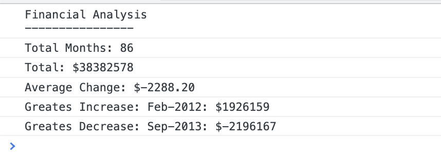

# Console Finances - js example

## Description

This is a javascript code that analyze the financial records of a company. The financial dataset was provided and is in the 'data.js' file.

 The code present here analyzes the records to calculate each of the following:

* The total number of months included in the dataset.

* The net total amount of Profit/Losses over the entire period.

* The average of the **changes** in Profit/Losses over the entire period.  

* The greatest increase in profits (date and amount) over the entire period.

* The greatest decrease in losses (date and amount) over the entire period.


## Installation

N/A 

## Usage

When you open your code in the browser your resulting analysis should look similar to the following:

  ```text
  Financial Analysis
  ----------------------------
  Total Months: 86
  Total:  $38382578
  Average  Change: $-2288.20
  Greatest Increase in Profits: Feb-2012: $1926159
  Greatest Decrease in Profits: Sep-2013: $-2196167
  ```

Your final code should print the analysis to the console.

## Screenshots 




## License

The MIT License (MIT)

Copyright (c) 2022 Sabrina Martorelli

Permission is hereby granted, free of charge, to any person obtaining a copy of this software and associated documentation files (the "Software"), to deal in the Software without restriction, including without limitation the rights to use, copy, modify, merge, publish, distribute, sublicense, and/or sell copies of the Software, and to permit persons to whom the Software is furnished to do so, subject to the following conditions:

The above copyright notice and this permission notice shall be included in all copies or substantial portions of the Software.

THE SOFTWARE IS PROVIDED "AS IS", WITHOUT WARRANTY OF ANY KIND, EXPRESS OR IMPLIED, INCLUDING BUT NOT LIMITED TO THE WARRANTIES OF MERCHANTABILITY, FITNESS FOR A PARTICULAR PURPOSE AND NONINFRINGEMENT. IN NO EVENT SHALL THE AUTHORS OR COPYRIGHT HOLDERS BE LIABLE FOR ANY CLAIM, DAMAGES OR OTHER LIABILITY, WHETHER IN AN ACTION OF CONTRACT, TORT OR OTHERWISE, ARISING FROM, OUT OF OR IN CONNECTION WITH THE SOFTWARE OR THE USE OR OTHER DEALINGS IN THE SOFTWARE.


## Deployment link

https://sabrina-martorelli.github.io/Console-Finances/

